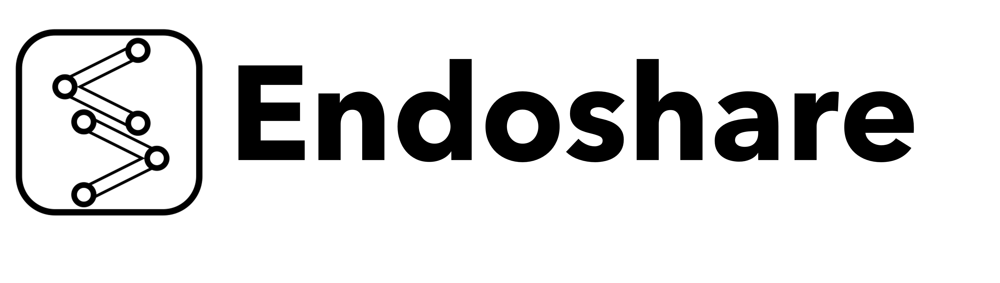
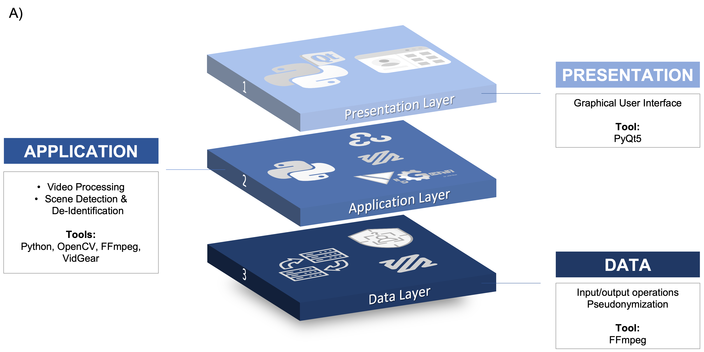
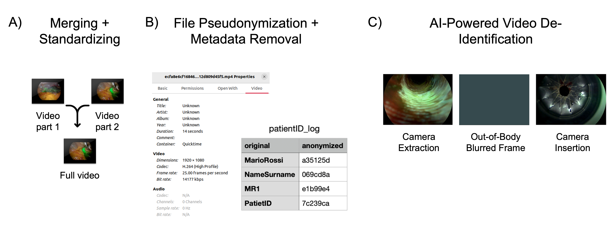
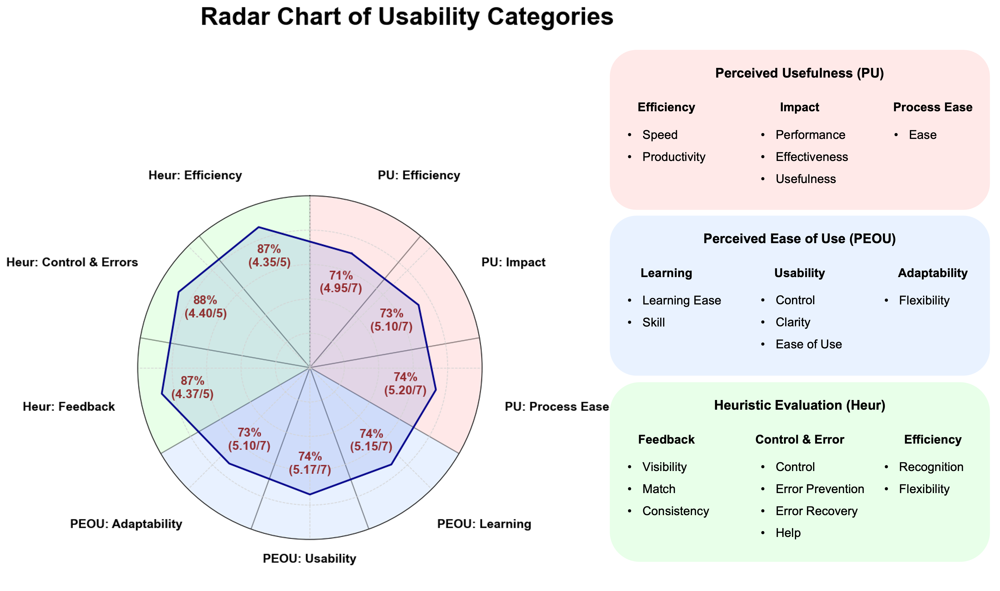

<div align="center">
<a href="http://camma.u-strasbg.fr/">

</a>
</div>

#  **Endoshare: A Source-Available Solution to De-Identify and Manage Surgical Videos**

***Research Group CAMMA / University of Strasbourg / IHU Strasbourg***

http://camma.u-strasbg.fr/

<center></center>

## Overview

**Endoshare** is a cross-platform, source-available desktop application that merges, standardizes, and de-identifies surgical videos for research, education, and clinical quality improvement.  
It was developed at the *University of Strasbourg – ICube Laboratory and IHU Strasbourg* to address the lack of accessible, privacy-preserving tools for managing endoscopic recordings.

The application is distributed under the **PolyForm Noncommercial License 1.0.0**, ensuring open access for research and educational purposes while restricting commercial use.

---

## **Architecture**

<center></center>

Endoshare follows a **three-layer architecture**:

1. **Presentation Layer** –  
   A **PyQt5-based GUI** allowing clinicians to perform all operations without coding.  
   Functions include:
   - Case selection  
   - Video merging  
   - Out-of-body detection and removal  
   - Filename pseudonymization  
   - Batch processing with progress indicators  

2. **Application Layer** –  
   Implements the processing pipeline in **Python**, integrating:
   - **FFmpeg** and **VidGear** for format standardization and merging  
   - **OpenCV** for frame manipulation  
   - **TensorFlow (MobileNetV2 + LSTM)** for automatic out-of-body (OoB) detection  
   - Dual processing modes:  
     - **Fast Mode** – minimal re-encoding for speed  
     - **Advanced Mode** – full re-encoding and parameter control  

3. **Data Layer** –  
   Manages I/O and ensures data integrity and confidentiality.  
   - All metadata is removed using FFmpeg.  
   - Filenames are replaced by pseudonyms (UUIDs).  
   - A local CSV log securely maps patient IDs to pseudonyms for traceability.

---

## **Core Features**

- 🧠 **AI-based Out-of-Body Scene Detection**  
  Identifies and blurs non-endoscopic frames using a MobileNetV2-LSTM network.

- 🔒 **Privacy-by-Design De-Identification**  
  Automatic removal of metadata and identifiers; local storage of pseudonym mappings.

- 💻 **Cross-Platform Availability**  
  Runs on **macOS**, **Windows**, and **Linux** — from laptops to high-performance servers.

- ⚡ **Dual Processing Modes**  
  Fast vs. Advanced, balancing efficiency and full control.

- 🔁 **Multithreaded Batch Execution**  
  Enables unattended overnight processing with progress monitoring.

- 🧾 **Transparent and Reproducible**  
  Full source code and documentation released under a noncommercial license.

---

## **Installation**

### From Binaries
Pre-compiled builds are available for:
- macOS (.dmg)
- Windows (.exe)
- Linux (.AppImage or .tar.gz)

Simply download the appropriate version from the [official release page](https://camma-public.github.io/Endoshare/), extract, and launch **Endoshare**.

### From Source
```bash
# 1. Clone the repository
git clone https://github.com/CAMMA-public/Endoshare_code.git
cd Endoshare_code

# 2. Install Python dependencies
pip install -r requirements.txt

# 3. Download model weights (OOBNet)
# Create the checkpoint directory and download weights into it
cd endoshare/resources
mkdir -p ckpt
cd ckpt
wget https://s3.unistra.fr/camma_public/github/oobnet_detection/ckpt/oobnet_weights.h5
cd ../../../

# 4. Install FFmpeg binaries
# The FFmpeg executable must be placed inside: endoshare/Externals/ffmpeg/

# ── macOS / Linux ────────────────────────────────
# Create the folder and download the static build
mkdir -p endoshare/Externals/ffmpeg
cd endoshare/Externals/ffmpeg
wget https://johnvansickle.com/ffmpeg/releases/ffmpeg-release-amd64-static.tar.xz
tar -xf ffmpeg-release-amd64-static.tar.xz
mv ffmpeg-*-static/ffmpeg .
cd ../../../..

# ── Windows ─────────────────────────────────────
# 1. Go to https://www.gyan.dev/ffmpeg/builds/
# 2. Download "ffmpeg-git-full.7z"
# 3. Extract it and copy the ffmpeg.exe binary into:
#      endoshare\\Externals\\ffmpeg\\ffmpeg.exe

# 5. Launch Endoshare
python main.py
```

Requirements:
- Python ≥ 3.11  
- FFmpeg, OpenCV, TensorFlow, PyQt5, loguru, tqdm, psutil  

---

## **How It Works**

1. **Load Cases** – Select a folder containing endoscopic video segments.  
2. **Merge Videos** – Automatically concatenates clips from the same case.  
3. **De-Identify** – Detects and removes out-of-body scenes; strips metadata.  
4. **Export** – Produces anonymized videos with consistent format and naming.  
5. **Review** – Preview results directly in the GUI.  

<center></center>

---

## **Validation and Usability**

<center></center>

- External survey of **10 surgeons**  
  → Perceived usefulness 5.07 ± 1.75 / 7  
  → Ease of use 5.15 ± 1.71 / 7  
  → Recommendation likelihood 9.2 ± 0.79 / 10  
- Processing time was significantly affected by:
  - Mode (Fast vs. Advanced)
  - Video duration (p ≤ 0.001)
  - Machine computational power (p = 0.041)

---

## **Privacy and Compliance**

Endoshare is research and educational software. It is not a medical device and is not certified for clinical or diagnostic use; manual review is recommended for privacy assurance.

---

## **Planned Extensions**

- Integration with surgical data lakes and PACS systems  
- Multi-user network mode  
- Compliance audit logging  
- Optional cloud-based anonymization queue  

---

## 🤝 **Contributors**

**Lorenzo Arboit**, Dennis N. Schneider, Britty Baby, Vinkle Srivastav, Pietro Mascagni, Nicolas Padoy  
*University of Strasbourg, ICube, INSERM, IHU Strasbourg, and Fondazione Policlinico Universitario Agostino Gemelli IRCCS.*

---

## 📜 **License**

This software is distributed under the **PolyForm Noncommercial License 1.0.0**.  
You may use, copy, and modify this software **for noncommercial purposes only**.  
See the full text in [`LICENSE`](./LICENSE).

---

<!-- ## 🧾 **Citation**

If you use Endoshare in academic work, please cite:

> Arboit L., Schneider D.N., Baby B., Srivastava V., Mascagni P., Padoy N.  
> *Endoshare: A Source-Available Solution to De-Identify and Manage Surgical Videos.*  
> (2025) arXiv:2506.08258. -->
